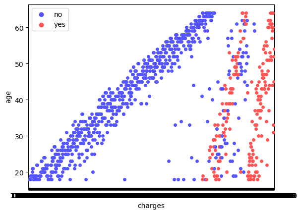
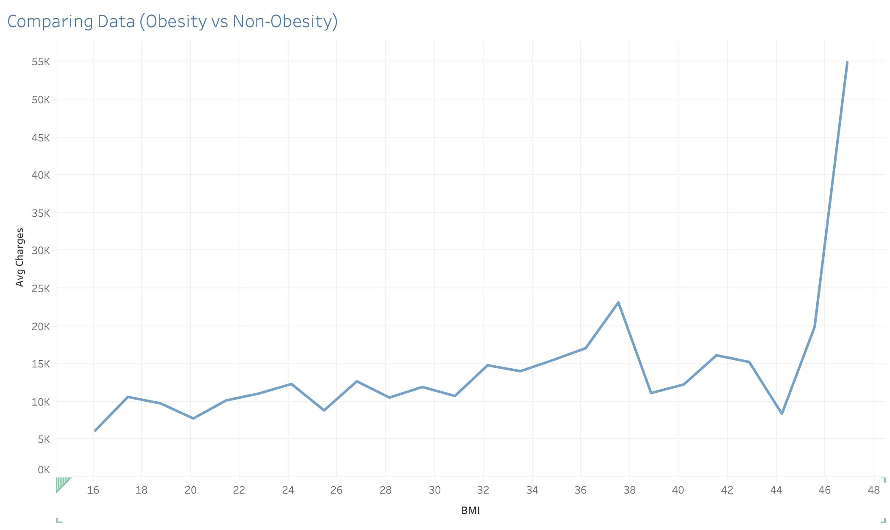
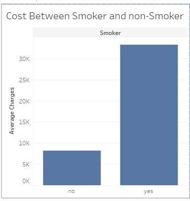
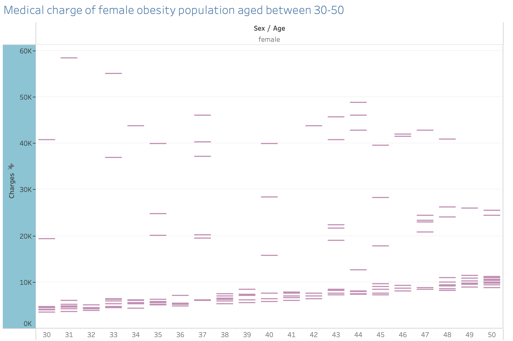
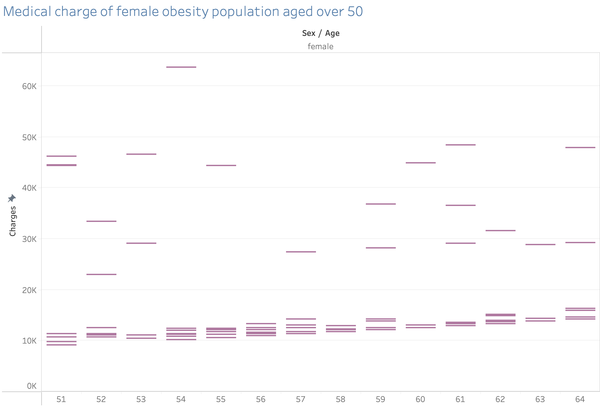

# Milestone 5

## Introduction
In this research project, we have decided to work on the health care topic, as we are all interested in the relationship between medical prices and different personal behaviors. The dataset that we will be using is provided by the Kaggle website, and this dataset was collected in the USA. As USA having one of the most expensive healthcare system, we expect that when a patient has more bad behavior (ex. smoke cigarettes) they will have way higher expense than those not. Therefore, in this research project, we will be diving into three main research questions: (1) How will the expense be different when the patient aged over 50 has a smoking habit? (2) How will the price be different when the female patient has obesity and an age range of 30 to 50, and will the price be higher when the age range is increased to over 50? and (3) Will having children, as a simulation of having more social stress, have any impact on medical charges for female adults in the age range of 30 to 50?
## Exploratory Data Analysis
By using the Seaborn and Tableau we have all receive an idea result for our research question. We will be include some of our highlighted chart to summarized our analyze. As all of us have include age as an indicator, we basically divide the observation into two age group, over 50 and under. We all expect that the higher the age is, the higher the expense will be. The other indicator will be the attributes, for example Jiajung is looking for the people with smoke behaviour and over 50. Therefore, he use the Seaborn to create the following chart to verify his hypothesis. 

The charge on this graph gets higher when the dots move to the right, and it is clear that the majority of the red dots(smokers) are on the right side and when the y axis gets higher the red dots moving more toward the end of x axis. 
The other graph we would like to show is from Lydia. 

This graph is from Tableau and it is actually comparing between the obesity population and non-obesity population, which the line gradually goes up when the bmi index increase, means there is a positive correlation between charge and bmi index.

## Research Questions
As mentioned above, we all receive an idea result from our research. So here comes the first research question created by Jiajung. How will the expense be different when the patient aged over 50 has a smoking habit?
Let's first comparing the smoker and non-smoker population shown by the following graph. 

We can see that the smoker collect way higher medical expense than those who don't smoke.  
The other two graph I want to show is average cost for smoker under 50 and over 50. 
We can see the average cost for the under 50 is around 30k and the over 50 has increased to 40k, which is a huge gap. 

In his hypothesis, the older population should be charged more than under 50 population as the body start to have lower metabolism and the smoke behavior should cause a larger effect to the body, which create a higher medical expense than the middle age. According to this research his hypothesis has been verified. 

The second research question is created by Lydia and she is going to demonstrate the difference on the expense between 30-50 obesity female population and over 50 obesity population. To answer this question she first use the tableau to find the relationship between average charge and bmi index. Gets a positive relationship, which the expense gets higher when bmi increase and it increase more when it go over the average bmi (25).

On the second and third graph she try to narrowing down by age. The aged 30-50 population is considered the middle age people and over 50 is the elders. elders should have more health problems when they also have obesity. My hypothesis is that the over 50 population should have much higher costs than those not. The graph shows the price does not have a large difference between those two groups but it is true that when the age increases medical costs will also increase and the difference between each age is approximately 1k.  

The third research question is asked by Terry Chang. He hypothesized that there will be a positive relationship with the number of children female has and medical costs. According to prevalence of mental disorders like depression and anxiety, women are more likely than men to have those disorders. Some theories suggested this is because women faced more social stress than men, one of which could be having children. Therefore, with having more children, a simulation as having more social stress, should suggest women with more children will seek therapy or treatment more often, thus increasing their medical costs. This research question focused on female age between 30 to 50. Visualizations were made to help answer this question.

The first graph displays the overal cost by each women in the dataset age between 30 to 50, whereas the second graph shows the number of children each female have in the same dataset. By comparing the two together, we can see a pattern where having more children does not necessarily contributes to increasing healthcare costs. For example, a lot of high medical costs were made by women with one to two children, spending over 40K, and only a few were made by women with more than 3 children. 

The third graph shows the average medical cost based on the number of children female in this dataset has. With this graph, it is clear that there is no positive correlation between number of children one has and healthcare cost. As shown by the graph, the highest average cost was female with two children, over 13K on average. When comparing this graph with the first and the second, we can see that the highest medical costs lie in range of female with two children. Based on these information, the answer to the third research question will be either women does not consider having more children as increase stress, or that having more chilren does not simulate as having more social stress, therefore, we see no increase medical costs in this condition because they are not spending more on treatment for stress. 

## Summary/Conclusion
In conclusion, through data analysis and several visualizations, we learned that in general with increasing age, the overall medical costs also increase. In the case of adult male smoker, costs were higher for male smoker over the age of 50 as compared to those under. There is also a significant costs difference between non smoker and smoker. In the other case of bmi in female, again, we see a pattern of with increasing age and bmi, the costs increased quite significantly. Specifically there is a positive correlation with increasing bmi and average costs. Finally, although we see no pattern of increasing age and number of children to increase costs, because it was not measured, we do see that with increasing number of children female has does not contributes to increasing costs. There is simply no siginficant pattern from the result to support or defy such relationship.